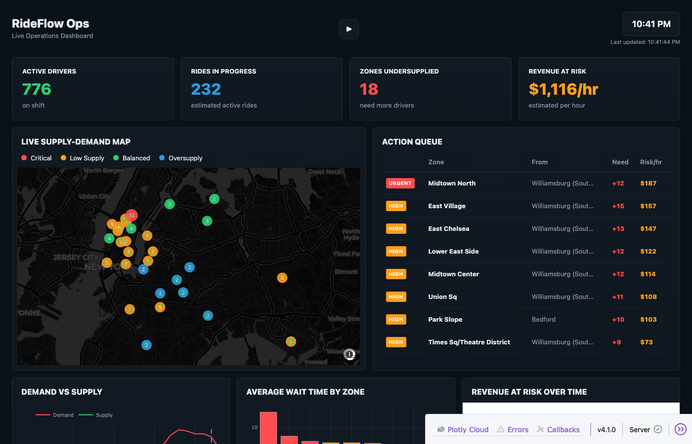

# RideFlow Ops

Real-time operations dashboard for NYC rideshare fleet management. Built with Dash/Plotly and powered by 62M TLC trip records.

**Live Demo:** https://rideshare-ops-intelligence.onrender.com



## Overview

**Problem:** Demand is not centered only in Manhattan, but wait times are still shortest there. Brooklyn accounts for 27% of pickups but riders wait longer. The data suggests supply is better aligned to Manhattan than to high-demand outer-borough zones.

**This project:** Analyzes 62.4 million NYC TLC trip records to identify supply-demand imbalances, then builds a simulation dashboard to visualize repositioning opportunities in real-time.

### Project Components

1. **[Notebook Analysis](notebooks/analysis.ipynb)** - Exploratory analysis of trip patterns, wait times, borough coverage, and NYE surge behavior
2. **[Dashboard](app.py)** - Real-time simulation showing supply-demand imbalances and repositioning recommendations

## Features

### Live Supply-Demand Map
- 39 NYC zones across all 5 boroughs
- Color-coded status: Critical (red), Low Supply (amber), Balanced (green), Oversupply (blue)
- Wait time displayed inside each zone marker
- Driver positions shown as green dots

### Action Queue
- Prioritized repositioning recommendations (URGENT/HIGH/MED)
- Shows which zone needs drivers and where to pull them from
- Drivers needed and revenue at risk per hour
- Sorted by revenue impact

### KPI Cards
- **Active Drivers** - Currently on shift (~750-800 at peak)
- **Rides in Progress** - Estimated active rides (~230 at peak)
- **Zones Undersupplied** - Need more drivers (~18-22 at peak)
- **Revenue at Risk** - Estimated hourly loss (~$1,100-1,500/hr at peak)

### Charts
- **Demand vs Supply** - 24-hour comparison across all zones
- **Average Wait Time by Zone** - Top 8 worst-performing zones
- **Revenue at Risk Over Time** - Hourly revenue impact projection

### Playback Mode
- Click play to simulate through a full 24-hour cycle
- Watch how supply-demand changes throughout the day
- 4-second intervals between hours

## Key Findings

From the [notebook analysis](notebooks/analysis.ipynb) of 62.4M trips:

### Brooklyn Residential Zones Matter
Brooklyn residential zones appear repeatedly in pickup rankings, NYE surge analysis, and supply-gap screening. Crown Heights North, East New York, Bushwick South, and Bedford are as operationally important as Manhattan hotspots.

### NYE Surge Patterns
New Year's Eve demand peaks between 8-10 PM, concentrated in **residential neighborhoods**, not Manhattan event destinations:

| Zone | NYE vs Normal December |
|------|------------------------|
| Stuyvesant Heights | +209% |
| Bushwick South | +183% |
| Bedford | +150% |
| Crown Heights North | +141% |

### Wait Time Disparity
Supply is better aligned to Manhattan than outer boroughs:
- **Manhattan**: 3.0 min median wait (36.5% of pickups)
- **Brooklyn**: 3.4 min median wait (27.2% of pickups)
- **Staten Island**: 4.6 min median wait (highest)
- **Overnight (4 AM)**: Peak wait times even with low demand

### Airports Are Their Own Category
JFK and LaGuardia combine very high trip volume with the longest average waits:
- LaGuardia: 1.2M trips, 5.8 min avg wait
- JFK: 1.0M trips, 5.8 min avg wait

These likely need a separate operational playbook from neighborhood demand.

## Data Pipeline

### Source Data
- NYC TLC For-Hire Vehicle High Volume trip records
- 62.4 million trips across January, June, and December 2025
- ~1.5GB of parquet files

### Preprocessing
The `preprocess_demand.py` script extracts hourly demand patterns:
```bash
python preprocess_demand.py
```
This generates `data/demand_patterns.json` containing:
- Trip counts per zone per hour per month
- Normalized hourly demand multipliers

### Demand Patterns
Real patterns from the data show:
- Peak demand at 6-9 PM (multiplier: 1.45-1.50)
- Lowest demand at 4-5 AM (multiplier: 0.32-0.35)
- Seasonal variations between winter and summer months

## Driver Simulation

The simulator models 1,500 drivers with 5 behavioral types:

| Type | % | Behavior |
|------|---|----------|
| Normal | 83% | Accept rides proportional to demand |
| Surge Gamer | 8% | Cluster in high-demand zones, 40% lower acceptance |
| Cherry Picker | 4% | Only accept trips > 3 miles |
| Ghost | 3% | Show available but 5% acceptance rate |
| Efficient | 2% | Follow demand signals, 95% acceptance |

Drivers have:
- Shift schedules (morning, evening, night, weekend)
- Zone movement based on demand patterns
- Realistic acceptance behavior

## Recommendation Engine

The engine calculates repositioning recommendations by:

1. **Estimating demand** from real TLC trip patterns
2. **Getting supply** from simulated driver positions
3. **Calculating wait time** using demand/supply ratio
4. **Finding source zones** with excess supply nearby
5. **Computing revenue impact** from reduced wait times

Wait time model:
```
wait_time = base_wait × (demand / (supply × availability × trips_per_hour))
```

Revenue impact model:
```
revenue = trips_recovered × average_fare ($18.50)
```

## Quick Start

```bash
# Install dependencies
pip install -r requirements.txt

# Run the dashboard
python app.py
```

Open http://localhost:8050

## Tech Stack

- **Dash** - Web application framework
- **Plotly** - Interactive charts and maps
- **Pandas** - Data manipulation
- **NumPy** - Numerical operations
- **PyArrow** - Parquet file reading

## Project Structure

```
├── notebooks/analysis.ipynb  # Exploratory data analysis
├── app.py                    # Dashboard application
├── driver_simulator.py       # Driver simulation engine
├── recommendations.py        # Repositioning recommendation engine
├── preprocess_demand.py      # TLC data preprocessing
├── requirements.txt          # Python dependencies
├── data/
│   ├── demand_patterns.json  # Preprocessed hourly demand (34KB)
│   ├── fhvhv_tripdata_*.parquet  # Raw TLC data (not in repo)
│   └── taxi_zone_lookup.csv  # Zone ID mappings
└── assets/
    ├── style.css             # Dashboard styling
    └── screenshot.png        # Dashboard screenshot
```

## Future Improvements

- Real-time data integration via TLC API
- Driver dispatch functionality
- Historical playback from actual dates
- Multi-city support
- Mobile-responsive layout
